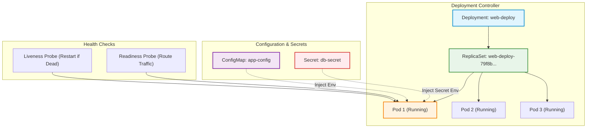

# Chào Mừng Đến Với Lab 20: Đóng Gói Pod, Triển Khai Deployment, Nạp ConfigMap/Secret & Cấu Hình Probes

Trong kiến trúc điều phối của Kubernetes, Pod là đơn vị tính toán nhỏ nhất có thể triển khai, nhưng trong thực tế vận hành sản xuất, các kỹ sư DevOps hiếm khi quản trị trực tiếp từng Pod riêng lẻ. Thay vào đó, chúng ta dựa vào các bộ điều khiển cấp cao như Deployment kết hợp với các cơ chế cấu hình tách biệt và hệ thống đầu dò sức khỏe tự động để đảm bảo ứng dụng luôn chạy với độ sẵn sàng cao nhất.

Bài lab này sẽ đưa bạn đi từ nền tảng khởi tạo Pod với các ràng buộc tài nguyên chặt chẽ, mở rộng lên mô hình Deployment tự phục hồi, nạp dữ liệu cấu hình phi tập trung và cấu hình các đầu dò sức khỏe thông minh nhằm đảm bảo lưu lượng mạng luôn được dẫn tới những vùng chứa hoạt động hoàn hảo.

---

## Mục Tiêu Học Tập

Sau khi hoàn thành bài thực hành này, bạn có khả năng:

1. **Khởi tạo và đóng gói** các thành phần ứng dụng vào Pod theo chuẩn khai báo tệp cấu hình, bao gồm việc giới hạn hạn mức tài nguyên tính toán phục vụ ổn định hệ thống.
2. **Triển khai và vận hành** khối lượng công việc thông qua đối tượng Deployment nhằm duy trì số lượng bản sao mong muốn, kiểm chứng cơ chế tự phục hồi và mở rộng quy mô tức thì.
3. **Phân tách và tiêm** dữ liệu cấu hình phi bí mật và thông tin nhạy cảm vào vùng chứa ứng dụng thông qua ConfigMap và Secret dưới dạng biến môi trường hoặc tệp gắn kết.
4. **Thiết lập và kiểm chứng** cơ chế giám sát sức khỏe ứng dụng tự động bằng các đầu dò hoạt động và đầu dò sẵn sàng nhằm phát hiện sự cố và điều phối lưu lượng mạng chính xác.

---

## Kiến Trúc Tổng Thể Các Khối Xây Dựng Ứng Dụng Trong K8s

---

## Lộ Trình 4 Bước Thực Hành

| Bước | Tên Bước | Trọng Tâm Kiến Thức & Kỹ Năng | Thời Gian |
| :---: | :--- | :--- | :---: |
| **01** | **Khởi Tạo Pod & Resource Requests/Limits** | Imperative dry-run, declarative YAML, thiết lập bảo vệ RAM/CPU tránh cạn kiệt tài nguyên node | 10 phút |
| **02** | **Triển Khai Deployment & Tự Phục Hồi** | Quản lý bản sao ReplicaSet, mô phỏng sự cố chết Pod kiểm chứng Self-healing, scale up/down tức thì | 10 phút |
| **03** | **Quản Trị ConfigMap & Secret** | Tách cấu hình khỏi mã nguồn, mã hóa Base64 thông tin bí mật, nạp biến môi trường động vào Pod | 10 phút |
| **04** | **Cấu Hình Liveness & Readiness Probes** | Phân biệt vai trò tự khởi động lại vùng chứa và kiểm soát điều phối luồng dữ liệu mạng | 10 phút |

---

Hãy nhấn **Start** hoặc chọn **Bước 1** ở thanh điều hướng để bắt đầu hành trình làm chủ khối lượng công việc trên Kubernetes!
