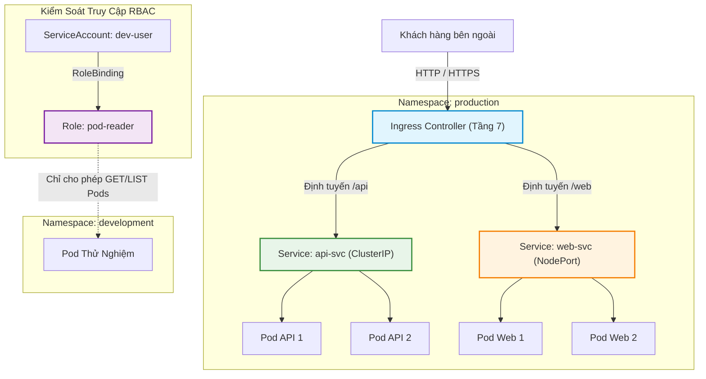

# Chào Mừng Đến Với Lab 21: Cấu Hình Service, Ingress, Phân Vùng Namespace & Phân Quyền RBAC

Trong môi trường điện toán đám mây và Kubernetes quy mô lớn, việc đóng gói ứng dụng vào Pod mới chỉ là bước khởi đầu. Để đưa ứng dụng vào phục vụ người dùng thực tế và vận hành an toàn giữa nhiều đội ngũ kỹ sư, bạn cần giải quyết ba bài toán cốt tử:
1. **Kết nối mạng & Cân bằng tải:** Làm sao để các Pod giao tiếp ổn định khi địa chỉ IP của chúng liên tục thay đổi, và làm sao để phơi bày ứng dụng ra thế giới bên ngoài?
2. **Cô lập không gian làm việc:** Làm sao để các môi trường phát triển, kiểm thử và sản xuất cùng tồn tại trên một cụm máy chủ mà không xung đột tài nguyên?
3. **An ninh & Kiểm soát truy cập:** Làm sao để giới hạn quyền hạn của từng kỹ sư và dịch vụ tự động, ngăn chặn các thao tác nhầm lẫn nguy hại tới hệ thống?

Bài lab này sẽ dẫn dắt bạn qua toàn bộ bức tranh mạng và an ninh của Kubernetes: từ phân vùng Namespace, cân bằng tải tầng 4 với ClusterIP và NodePort Service, định tuyến tầng 7 với Ingress, cho đến thiết lập ma trận kiểm soát truy cập dựa trên vai trò với RBAC.

---

## Mục Tiêu Học Tập

Sau khi hoàn thành bài thực hành này, bạn có khả năng:

1. **Khởi tạo và phân vùng** tài nguyên mạng và khối lượng công việc trên cụm thông qua các không gian tên độc lập nhằm cô lập môi trường và tối ưu hóa quản trị.
2. **Cấu hình và kiểm chứng** khả năng cân bằng tải nội bộ và phơi bày dịch vụ ra mạng ngoài bằng các đối tượng dịch vụ mạng theo từng nhu cầu kết nối.
3. **Thiết lập và vận hành** cơ chế định tuyến lưu lượng ứng dụng tầng bảy thông qua bộ điều khiển lối vào nhằm tối ưu hóa cổng truy cập và điều phối linh hoạt theo đường dẫn.
4. **Phân quyền và bảo mật** quyền hạn tương tác với cụm cho từng tài khoản dịch vụ dựa trên mô hình kiểm soát truy cập theo vai trò và phạm vi không gian tên.

---

## Kiến Trúc Mạng Và Ma Trận Phân Quyền Trong Kubernetes

---

## Lộ Trình 4 Bước Thực Hành

| Bước | Tên Bước | Trọng Tâm Kiến Thức & Kỹ Năng | Thời Gian |
| :---: | :--- | :--- | :---: |
| **01** | **Phân Vùng Với Namespace** | Khởi tạo không gian tên, định vị tài nguyên theo phạm vi ngữ cảnh, truy vấn đa không gian tên | 10 phút |
| **02** | **Cân Bằng Tải ClusterIP & NodePort** | Khắc phục IP động của Pod, cân bằng tải nội bộ và phơi bày ứng dụng ra cổng máy chủ | 15 phút |
| **03** | **Điều Phối Tầng 7 Với Ingress** | Định tuyến dựa trên đường dẫn URL, hợp nhất cổng truy cập HTTP, chuyển hướng lưu lượng thông minh | 10 phút |
| **04** | **Phân Quyền RBAC Với ServiceAccount & Role** | Mô hình Subject - Role - RoleBinding, phân quyền tối thiểu và kiểm thử quyền bằng can-i | 10 phút |

---

Hãy nhấn **Start** hoặc chọn **Bước 1** ở thanh điều hướng để bắt đầu!
