# Chào Mừng Đến Với Lab 22: Cấp Phát Động StorageClass, Triển Khai StatefulSet, Cấu Hình HPA & Đóng Gói Helm Chart

Chào mừng bạn đến với bài thực hành nâng cao về khối lượng công việc và quản trị vòng đời ứng dụng trong Kubernetes. Ở các bài học trước, chúng ta đã nắm vững các ứng dụng phi trạng thái (Stateless) và các cơ chế mạng cơ bản. Tuy nhiên, trong các hệ thống doanh nghiệp thực tế, các kỹ sư DevOps phải liên tục đối mặt với 4 thách thức lớn:
1. **Lưu trữ dữ liệu bền vững:** Làm sao để dữ liệu của cơ sở dữ liệu không bị biến mất khi Pod bị khởi động lại, và làm sao để ổ đĩa được tự động cấp phát theo nhu cầu mà không cần quản trị viên tạo thủ công từng volume?
2. **Quản lý ứng dụng có trạng thái:** Làm sao để chạy các cụm cơ sở dữ liệu (PostgreSQL, MySQL, Redis, Kafka) với danh tính mạng và ổ đĩa gắn kết riêng biệt cho từng nút?
3. **Tự động mở rộng quy mô theo tải:** Làm sao để hệ thống tự động tăng số lượng Pod khi lưu lượng tăng đột biến và thu hẹp khi tải giảm để tối ưu chi phí?
4. **Chuẩn hóa đóng gói và phân phối:** Làm sao để đóng gói toàn bộ hàng chục tệp YAML của một dự án thành một gói cài đặt duy nhất có thể tái sử dụng qua nhiều môi trường?

Bài lab này sẽ trang bị cho bạn trọn vẹn bộ công cụ và kỹ năng để giải quyết xuất sắc cả 4 bài toán trên.

---

## Mục Tiêu Học Tập

Sau khi hoàn thành bài thực hành này, bạn có khả năng:

1. **Cấu hình và kiểm chứng** cơ chế cấp phát động bộ lưu trữ thông qua lớp lưu trữ và yêu cầu cấp phát khối lượng nhằm bảo toàn dữ liệu độc lập với vòng đời vùng chứa.
2. **Triển khai và vận hành** khối lượng công việc có trạng thái với bộ điều khiển ứng dụng có trạng thái kết hợp dịch vụ không đầu để duy trì danh tính mạng và ổ đĩa riêng biệt.
3. **Thiết lập và giám sát** cơ chế tự động co giãn số lượng bản sao dựa trên mức độ tiêu thụ tài nguyên thực tế thông qua bộ tự động mở rộng quy mô nhóm ứng dụng.
4. **Đóng gói và quản lý** vòng đời triển khai ứng dụng dạng gói mẫu chuẩn thông qua công cụ quản lý gói nhằm tham số hóa cấu hình và kiểm soát phiên bản phát hành.

---

## Kiến Trúc Tổng Thể Các Thành Phần Nâng Cao

```mermaid
graph TD
    subgraph "1. Dynamic Storage Provisioning"
        PVC["PersistentVolumeClaim (PVC)"] -->|Yêu cầu cấp phát| SC["StorageClass (local-path)"]
        SC -->|Tự động sinh| PV["PersistentVolume (PV)"]
    end

    subgraph "2. Stateful Workloads"
        HEADLESS["Headless Service (ClusterIP: None)"] -.-> ST_POD0["Pod: db-0"]
        HEADLESS -.-> ST_POD1["Pod: db-1"]
        ST_POD0 --- PVC0["PVC: data-db-0"]
        ST_POD1 --- PVC1["PVC: data-db-1"]
    end

    subgraph "3. Auto-scaling Architecture"
        METRICS["Metrics-Server"] -->|Thu thập CPU/RAM| HPA["HorizontalPodAutoscaler"]
        HPA -->|Tự động Scale| DEP["Deployment (web-deploy)"]
    end

    subgraph "4. Package Management"
        HELM["Helm Client"] -->|Cài đặt Release| CHART["Helm Chart (Templates + Values)"]
        CHART --> K8S_RESOURCES["K8s Manifests (YAML)"]
    end

    style SC fill:#e1f5fe,stroke:#0288d1,stroke-width:2px;
    style PV fill:#e8f5e9,stroke:#388e3c,stroke-width:2px;
    style HEADLESS fill:#fff3e0,stroke:#f57c00,stroke-width:2px;
    style HPA fill:#f3e5f5,stroke:#7b1fa2,stroke-width:2px;
    style HELM fill:#fce4ec,stroke:#c2185b,stroke-width:2px;
```

---

## Lộ Trình 4 Bước Thực Hành

| Bước | Tên Bước | Trọng Tâm Kiến Thức & Kỹ Năng | Thời Gian |
| :---: | :--- | :--- | :---: |
| **01** | **Cấp Phát Lưu Trữ Động (StorageClass & PVC)** | Cơ chế Dynamic Provisioning, vòng đời PVC & PV, gắn kết lưu trữ bền vững vào Pod | 10 phút |
| **02** | **Ứng Dụng Có Trạng Thái (StatefulSet & Headless Service)** | Danh tính mạng cố định, thứ tự khởi động tuần tự, mẫu cấp phát ổ đĩa riêng | 15 phút |
| **03** | **Tự Động Mở Rộng Quy Mô (HPA & Metrics-Server)** | Giám sát mức sử dụng CPU thời gian thực, thiết lập ngưỡng kích hoạt co giãn tự động | 10 phút |
| **04** | **Đóng Gói Ứng Dụng Với Helm Chart** | Cấu trúc thư mục Chart, biến số hóa qua Values, cài đặt và nâng cấp bản phát hành | 10 phút |

---

Hãy nhấn **Start** hoặc chọn **Bước 1** ở thanh điều hướng để bắt đầu!
