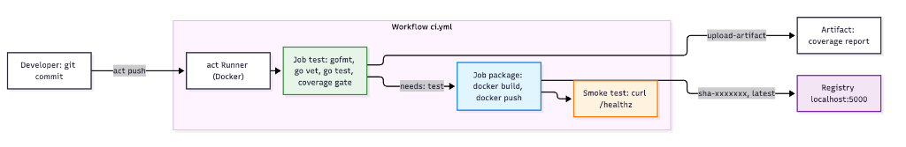

# Chào Mừng Đến Với Lab 23: Xây Dựng Pipeline CI/CD Cơ Bản — Kiểm Thử & Đóng Gói Ứng Dụng

Ở các bài trước, bạn đã tự tay viết Git hooks (Lab 6), xử lý Pull Request (Lab 7) và thiết kế Dockerfile multi-stage chuẩn Production (Lab 11). Tuy nhiên, tất cả vẫn là **thao tác thủ công trên máy của từng người**. Trong một đội ngũ thực tế, cách làm này sinh ra những vấn đề quen thuộc:

1. **"Máy em chạy được mà!"** — Mỗi lập trình viên một môi trường, code pass trên máy A nhưng lỗi trên máy B.
2. **Quên chạy test trước khi merge** — Bug lọt vào nhánh `main` và chỉ bị phát hiện khi đã lên Production.
3. **Image không truy vết được** — Image `myapp:latest` đang chạy được build từ commit nào? Không ai trả lời được.
4. **Build thủ công, mỗi lần một kiểu** — Người build quên cờ tối ưu, người khác build từ code chưa commit.

**CI/CD (Continuous Integration / Continuous Delivery)** giải quyết triệt để các vấn đề trên bằng cách biến toàn bộ quy trình kiểm thử và đóng gói thành **mã nguồn (Pipeline as Code)**, chạy tự động, nhất quán và lặp lại được trên mọi commit.

---

## Mục Tiêu Học Tập

Sau khi hoàn thành bài thực hành này, bạn có khả năng:

1. **Giải thích** vòng đời một pipeline CI/CD và các khái niệm cốt lõi: workflow, trigger, job, step, runner, artifact.
2. **Viết** workflow GitHub Actions khai báo các bước kiểm tra chất lượng: kiểm tra format, phân tích tĩnh và unit test.
3. **Thiết lập** cổng chất lượng (Quality Gate) theo ngưỡng coverage và vận dụng cơ chế Fail-Fast để chặn mã lỗi.
4. **Đóng gói** ứng dụng thành Docker image bất biến, gắn tag truy vết theo Git SHA và publish lên registry.
5. **Tự động hóa** smoke test cho image vừa phát hành và thực hiện trọn vòng đời ra mắt phiên bản mới.

---

## Môi Trường Thực Hành

Killercoda không kết nối tới GitHub thật, vì vậy chúng ta dùng **`act`** — công cụ mã nguồn mở chạy workflow **GitHub Actions ngay trên máy cục bộ** bằng Docker. File `ci.yml` bạn viết trong bài này có thể đưa lên GitHub thật và chạy được ngay mà không cần sửa.

| Thành phần | Vai trò | Tương đương trên thực tế |
|---|---|---|
| `/root/cicd-app` | Repo Git chứa Go microservice | Repository trên GitHub |
| `.github/workflows/ci.yml` | Định nghĩa pipeline | Giữ nguyên |
| `act` | Đọc workflow và chạy từng job trong container | GitHub-hosted Runner |
| `localhost:5000` | Docker Registry nội bộ | Docker Hub, GHCR, ECR |

---

## Kiến Trúc Pipeline Sẽ Xây Dựng

---

## Lộ Trình 4 Bước Thực Hành

| Bước | Tên Bước | Trọng Tâm Kiến Thức & Kỹ Năng | Thời Gian |
| :---: | :--- | :--- | :---: |
| **01** | **Pipeline CI Đầu Tiên** | Cấu trúc workflow YAML, trigger, job, step, chạy pipeline với `act` | 12 phút |
| **02** | **Cổng Chất Lượng & Fail-Fast** | Đọc log pipeline lỗi, sửa format và bug, ngưỡng coverage, merge an toàn | 13 phút |
| **03** | **Đóng Gói & Publish Image** | Job phụ thuộc `needs`, điều kiện `if`, tag Git SHA, registry, artifact | 13 phút |
| **04** | **Smoke Test & Phát Hành Phiên Bản Mới** | Kiểm chứng image sau build, vòng đời commit → pipeline → bản phát hành, rollback | 10 phút |

> **Lưu ý:** Môi trường cần 1-3 phút để tải image runner (~540MB). Hãy đợi terminal báo **"Moi truong CI/CD da san sang!"** trước khi bắt đầu.

---

Hãy nhấn **Start** hoặc chọn **Bước 1** ở thanh điều hướng để bắt đầu!
