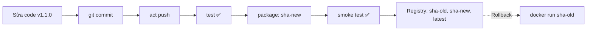

# Bước 4: Smoke Test Tự Động & Vòng Đời Phát Hành Phiên Bản Mới

Image đã lên registry, nhưng **build thành công chưa chắc đã chạy được**: thiếu file, sai quyền, sai cổng hay sai `ENTRYPOINT` đều không bị unit test phát hiện. Bước cuối cùng của pipeline là **smoke test**: khởi chạy chính image vừa build và kiểm tra nó phản hồi đúng. Sau đó, bạn sẽ đi trọn một vòng phát hành phiên bản mới và thực hành rollback.

---

## 1. Smoke Test Là Gì?

Thuật ngữ đến từ ngành điện tử: cắm điện thiết bị mới, nếu **không bốc khói** thì mới kiểm tra tiếp. Trong phần mềm, smoke test là bộ kiểm tra **nhanh, nông, bao quát**:

| Loại kiểm thử | Kiểm tra gì | Chạy trên |
|---|---|---|
| Unit test | Từng hàm riêng lẻ | Mã nguồn |
| **Smoke test** | Ứng dụng có khởi động và phản hồi được không | **Image đã đóng gói** |
| Integration/E2E test | Luồng nghiệp vụ đầy đủ với DB, dịch vụ khác | Môi trường Staging |

Một smoke test điển hình cho dịch vụ web:

```bash
docker run -d --name cicd-app-smoke -p 8088:8080 myimage:tag
curl -fsS http://localhost:8088/healthz     # -f: trả về exit code lỗi nếu HTTP >= 400
```

Container cần vài giây để khởi động, vì vậy nên **thử lại nhiều lần** thay vì `sleep` cố định:

```bash
for i in $(seq 1 10); do
  curl -fsS http://localhost:8088/healthz && exit 0
  sleep 1
done
echo "Smoke test that bai"; docker logs cicd-app-smoke; exit 1
```

---

## 2. Vòng Đời Phát Hành Với CI/CD



Nhờ mỗi commit có một tag SHA bất biến, **rollback** chỉ đơn giản là chạy lại image của commit trước. Không cần build lại, không cần revert code gấp.

---

## 3. Thử Thách Thực Hành (DIY Challenge)

```bash
cd /root/cicd-app
git checkout main
```

### Nhiệm vụ 1: Thêm smoke test vào job `package`

Thêm step `Smoke test` vào **cuối job `package`** (sau khi push image), yêu cầu:

- Xóa container cũ tên `cicd-app-smoke` nếu có (không báo lỗi nếu chưa tồn tại)
- Chạy container **nền** tên `cicd-app-smoke` từ image `$IMAGE:$TAG`, ánh xạ cổng `8088` của máy sang `8080` của container
- Gọi `http://localhost:8088/healthz` bằng `curl -fsS`, **thử lại tối đa 10 lần**, mỗi lần cách nhau 1 giây
- Nếu sau 10 lần vẫn thất bại: in log container và `exit 1`

> **Gợi ý cho step Smoke test:**
> ```yaml
>       - name: Smoke test
>         run: |
>           docker rm -f cicd-app-smoke 2>/dev/null || true
>           docker run -d --name cicd-app-smoke -p 8088:8080 "$IMAGE:$TAG"
>           for i in $(seq 1 10); do
>             if curl -fsS http://localhost:8088/healthz; then
>               echo ""
>               echo "Smoke test passed (lan thu $i)"
>               exit 0
>             fi
>             sleep 1
>           done
>           echo "Smoke test that bai"
>           docker logs cicd-app-smoke
>           exit 1
> ```

> Container smoke test được **giữ lại** sau khi pipeline kết thúc, đóng vai trò môi trường "staging" để bạn kiểm tra tiếp.

### Nhiệm vụ 2: Phát hành phiên bản 1.1.0

1. Sửa hằng số `Version` trong `main.go` từ `"1.0.0"` thành `"1.1.0"` (bằng trình soạn thảo hoặc lệnh `sed -i 's/"1.0.0"/"1.1.0"/' main.go`)
2. Kiểm tra cục bộ: `go test ./...`
3. Commit **cả thay đổi workflow và mã nguồn** với thông điệp `feat: phat hanh phien ban 1.1.0`
4. Chạy pipeline:

```bash
act push 2>&1 | tee /root/ci-logs/step4.log
```

5. Kiểm chứng:

```bash
curl -s http://localhost:8088/healthz
curl -s http://localhost:5000/v2/cicd-app/tags/list
docker inspect cicd-app-smoke --format '{{.Config.Image}} | user={{.Config.User}}'
```

Registry giờ có **ít nhất 2 tag SHA**: bản 1.0.0 từ Bước 3 và bản 1.1.0 vừa phát hành. Container chạy với `user=10001:10001` nhờ Dockerfile non-root từ Lab 11.

### Nhiệm vụ 3 (Không chấm điểm): Diễn tập Rollback

Giả sử bản 1.1.0 gặp sự cố trên Production. Hãy chạy lại bản cũ ở cổng khác mà không cần build lại:

```bash
OLD_TAG=$(curl -s http://localhost:5000/v2/cicd-app/tags/list | grep -o 'sha-[0-9a-f]*' | head -1)
echo "Rollback ve: $OLD_TAG"
docker run -d --name cicd-app-rollback -p 8089:8080 localhost:5000/cicd-app:$OLD_TAG
sleep 2 && curl -s http://localhost:8089/healthz
docker rm -f cicd-app-rollback
```

> Lệnh trên lấy tag SHA đầu tiên trong danh sách. Thứ tự tag trong registry không đảm bảo theo thời gian, hãy đối chiếu với `git log --oneline` để chọn đúng bản cần rollback. **Đừng xóa** container `cicd-app-smoke` trước khi bấm Check.

Sau khi hoàn thành, hãy bấm nút **Check** để hệ thống kiểm tra smoke test và phiên bản đang chạy.
