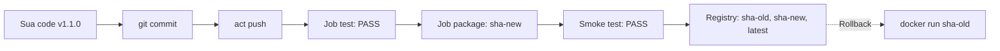

# Bước 4: Smoke Test Tự Động & Vòng Đời Phát Hành Phiên Bản Mới

Image đã lên registry, nhưng **build thành công chưa chắc đã chạy được**: thiếu file, sai quyền, sai cổng hay sai `ENTRYPOINT` đều không bị unit test phát hiện. Bước cuối cùng của pipeline là **smoke test**: khởi chạy chính image vừa build và kiểm tra nó phản hồi đúng. Sau đó, bạn sẽ đi trọn một vòng phát hành phiên bản mới và thực hành rollback.

---

## 1. Smoke Test Là Gì?

Thuật ngữ đến từ ngành điện tử: cắm điện thiết bị mới, nếu **không bốc khói** thì mới kiểm tra tiếp. Trong phần mềm, smoke test là bộ kiểm tra **nhanh, nông, bao quát**:

| Loại kiểm thử | Kiểm tra gì | Chạy trên |
|---|---|---|
| Unit test | Từng hàm riêng lẻ | Mã nguồn |
| **Smoke test** | Ứng dụng có khởi động và phản hồi được không | **Image đã đóng gói** |
| Integration/E2E test | Luồng nghiệp vụ đầy đủ với DB, dịch vụ khác | Môi trường Staging |

Một smoke test điển hình cho dịch vụ web:

```bash
docker run -d --name cicd-app-smoke -p 8088:8080 myimage:tag
curl -fsS http://localhost:8088/healthz     # -f: trả về exit code lỗi nếu HTTP >= 400
```

Container cần vài giây để khởi động, vì vậy nên **thử lại nhiều lần** thay vì `sleep` cố định:

```bash
for i in $(seq 1 10); do
  curl -fsS http://localhost:8088/healthz && exit 0
  sleep 1
done
echo "Smoke test that bai"; docker logs cicd-app-smoke; exit 1
```

---

## 2. Vòng Đời Phát Hành Với CI/CD



Nhờ mỗi commit có một tag SHA bất biến, **rollback** chỉ đơn giản là chạy lại image của commit trước. Không cần build lại, không cần revert code gấp.

---

## 3. Thực Hành Từng Bước (Step-by-Step)

### Bước 4.1 — Bổ sung step Smoke Test vào Job `package`

Đảm bảo bạn đang ở thư mục ứng dụng và cập nhật tệp `.github/workflows/ci.yml` để thêm step `Smoke test` ở cuối job `package`:

```bash
cd /root/cicd-app
git checkout main
```{{exec}}

```bash
cat << 'EOF' > .github/workflows/ci.yml
name: CI

on:
  push:
    branches: [main, "feature/**"]
  pull_request:
    branches: [main]

jobs:
  test:
    name: Lint & Unit Test
    runs-on: ubuntu-latest
    steps:
      - name: Checkout source
        uses: actions/checkout@v4

      - name: Setup Go
        uses: actions/setup-go@v5
        with:
          go-version: "1.22"
          cache: false

      - name: Check formatting (gofmt)
        run: |
          UNFORMATTED=$(gofmt -l .)
          if [ -n "$UNFORMATTED" ]; then
            echo "Cac file chua dung chuan gofmt:"
            echo "$UNFORMATTED"
            exit 1
          fi

      - name: Static analysis (go vet)
        run: go vet ./...

      - name: Unit test
        run: go test -v -coverprofile=coverage.out ./...

      - name: Coverage gate (>= 70%)
        run: |
          COVERAGE=$(go tool cover -func=coverage.out | awk '/^total:/ {gsub("%","",$3); print $3}')
          echo "Total coverage: ${COVERAGE}%"
          if ! awk -v c="$COVERAGE" 'BEGIN { exit (c >= 70) ? 0 : 1 }'; then
            echo "Coverage ${COVERAGE}% thap hon nguong 70%"
            exit 1
          fi

      - name: Upload coverage report
        uses: actions/upload-artifact@v4
        with:
          name: coverage-report
          path: coverage.out

  package:
    name: Build & Publish Image
    needs: test
    if: github.ref == 'refs/heads/main'
    runs-on: ubuntu-latest
    env:
      IMAGE: localhost:5000/cicd-app
    steps:
      - name: Checkout source
        uses: actions/checkout@v4

      - name: Compute image tag
        run: echo "TAG=sha-${GITHUB_SHA::7}" >> "$GITHUB_ENV"

      - name: Build image
        run: docker build -t "$IMAGE:$TAG" -t "$IMAGE:latest" .

      - name: Push image
        run: |
          docker push "$IMAGE:$TAG"
          docker push "$IMAGE:latest"

      - name: Smoke test
        run: |
          docker rm -f cicd-app-smoke 2>/dev/null || true
          docker run -d --name cicd-app-smoke -p 8088:8080 "$IMAGE:$TAG"
          for i in $(seq 1 10); do
            if curl -fsS http://localhost:8088/healthz; then
              echo ""
              echo "Smoke test passed (lan thu $i)"
              exit 0
            fi
            sleep 1
          done
          echo "Smoke test that bai"
          docker logs cicd-app-smoke
          exit 1
EOF
```{{exec}}

**Cơ chế hoạt động của step Smoke Test:**
1. Dọn dẹp container `cicd-app-smoke` cũ (nếu có) để tránh xung đột cổng.
2. Khởi chạy container nền từ chính image vừa build (`$IMAGE:$TAG`), ánh xạ cổng `8088` của máy vào `8080` của container.
3. Vòng lặp `seq 1 10` kiểm tra endpoint `http://localhost:8088/healthz` liên tục tối đa 10 lần (mỗi lần cách nhau 1 giây), đảm bảo ứng dụng đã thực sự sẵn sàng trước khi kết luận.
4. Container này được giữ lại sau khi pipeline kết thúc để phục vụ kiểm tra tiếp.

---

### Bước 4.2 — Phát hành phiên bản mới v1.1.0 và kích hoạt pipeline

Nâng phiên bản trong `main.go` từ `1.0.0` lên `1.1.0`:

```bash
sed -i 's/Version = "1.0.0"/Version = "1.1.0"/' main.go
go test -v ./...
```{{exec}}

Commit cả workflow và mã nguồn, sau đó kích hoạt toàn bộ pipeline:

```bash
git add main.go .github/workflows/ci.yml
git commit -m "feat: phat hanh phien ban 1.1.0"
act push 2>&1 | tee /root/ci-logs/step4.log
```{{exec}}

---

### Bước 4.3 — Kiểm chứng container và phiên bản mới phát hành

Kiểm tra endpoint `/healthz` trên container smoke test:

```bash
curl -s http://localhost:8088/healthz
```{{exec}}

Kiểm tra danh sách tag trong Registry:

```bash
curl -s http://localhost:5000/v2/cicd-app/tags/list
```{{exec}}

Xác nhận container chạy dưới quyền tài khoản non-root (`user=10001:10001`):

```bash
docker inspect cicd-app-smoke --format '{{.Config.Image}} | user={{.Config.User}}'
```{{exec}}

Registry hiện tại đã lưu trữ ít nhất 2 bản tag SHA: bản v1.0.0 (từ Bước 3) và bản v1.1.0 (vừa phát hành).

---

### Bước 4.4 — Diễn tập Rollback tức thì (Không cần Rebuild)

Giả định phiên bản 1.1.0 gặp sự cố ngoài thực tế. Nhờ chiến lược gắn tag SHA bất biến, bạn có thể chạy lại phiên bản trước đó chỉ trong tích tắc:

```bash
OLD_TAG=$(curl -s http://localhost:5000/v2/cicd-app/tags/list | grep -o 'sha-[0-9a-f]*' | head -1)
echo "Rollback ve: $OLD_TAG"
docker run -d --name cicd-app-rollback -p 8089:8080 localhost:5000/cicd-app:$OLD_TAG
sleep 2 && curl -s http://localhost:8089/healthz
docker rm -f cicd-app-rollback
```{{exec}}

> **Lưu ý:** Lệnh trên lấy tag SHA cũ trong danh sách để chạy thử nghiệm trên cổng 8089 và dọn dẹp sau khi kiểm tra. **Không xóa** container `cicd-app-smoke` trước khi bấm Check.

Sau khi hoàn thành, hãy nhấn nút **Check** để hệ thống kiểm tra smoke test và phiên bản đang chạy.
