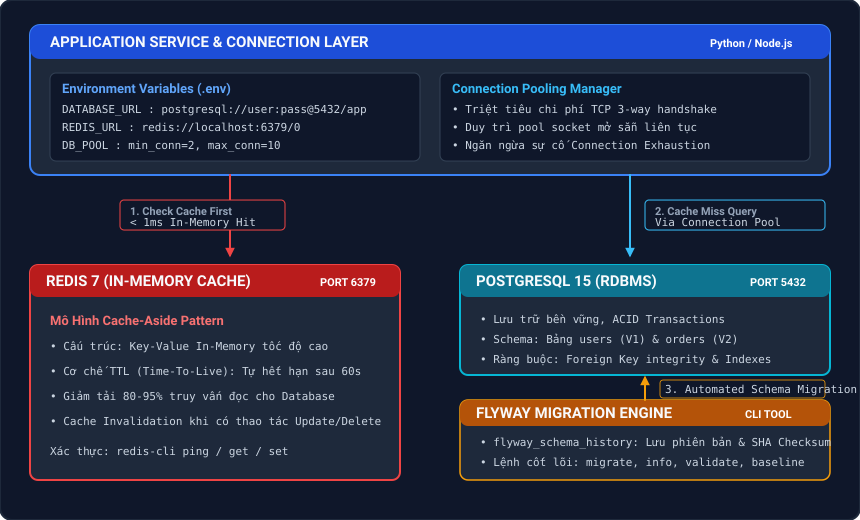

# Chào Mừng Đến Với Lab 8: Triển Khai Kết Nối PostgreSQL, Redis & Chạy Flyway Migration

Trong kiến trúc hệ thống hiện đại, dữ liệu ứng dụng thường được phân chia thành hai tầng chuyên biệt:
1. **Tầng Lưu Trữ Bền Vững (Persistent Storage - PostgreSQL)**: Đảm bảo tính toàn vẹn dữ liệu quan hệ theo chuẩn ACID, lưu trữ các thực thể cốt lõi như người dùng, đơn hàng và giao dịch tài chính.
2. **Tầng Bộ Nhớ Đệm Tốc Độ Cao (In-Memory Cache - Redis)**: Giảm tải cho cơ sở dữ liệu chính, lưu trữ session, dữ liệu đọc thường xuyên (hot data) với độ trễ phản hồi dưới 1 phần nghìn giây.

Để vận hành an toàn và mở rộng quy mô trong môi trường DevOps/CI-CD, hệ thống đòi hỏi hai năng lực then chốt:
- **Cấu hình kết nối an toàn & Connection Pooling**: Tuân thủ nguyên tắc 12-Factor App (quản lý thông tin chứng thực qua biến môi trường) và duy trì nhóm kết nối sẵn sàng (Connection Pool) để triệt tiêu chi phí khởi tạo socket và fork tiến trình của PostgreSQL.
- **Quản lý phiên bản CSDL tự động (Database Migration as Code với Flyway)**: Tự động hóa các thay đổi cấu trúc bảng trong pipeline triển khai và **kiểm tra nghiêm ngặt tính toàn vẹn của kết nối cũng như dữ liệu** sau mỗi lần migration.

---

## Kiến Trúc Hệ Thống & Dòng Chảy Dữ Liệu

### Mô Tả Luồng Tương Tác & Thành Phần Hệ Thống

| Thành Phần | Cổng & Giao Thức | Vai Trò & Cơ Chế Hoạt Động |
|---|---|---|
| **Application Layer** | TCP / Sockets | Cấu hình qua biến môi trường (`.env`), tối ưu hóa kết nối qua **Connection Pooling** để tái sử dụng socket và tránh cạn kiệt tài nguyên. |
| **Redis 7 (Cache)** | Port 6379 | Triển khai mô hình **Cache-Aside**, lưu trữ In-Memory với TTL 60s giúp phản hồi dữ liệu tức thì (&lt; 1ms) và giảm tải cho CSDL. |
| **PostgreSQL 15 (DB)** | Port 5432 | Lưu trữ dữ liệu quan hệ bền vững (ACID), duy trì tính toàn vẹn thông qua ràng buộc khóa chính (PK) và khóa ngoại (FK). |
| **Flyway CLI** | JDBC (Port 5432) | Tự động hóa cập nhật lược đồ CSDL (Migration as Code), đối soát tính toàn vẹn cấu trúc thông qua mã băm Checksum trong `flyway_schema_history`. |

---

## Lộ Trình 3 Bước Thực Hành

| Bước | Chủ Đề | Nội Dung Chi Tiết |
|---|---|---|
| **Bước 1** | **Kết Nối An Toàn & Connection Pool** | Cấu hình biến môi trường (`.env`), hiểu cơ chế Connection Pooling; thực hành thao tác bảo mật với `psql` (tạo role, cấp quyền) và `redis-cli` (key-value, TTL). |
| **Bước 2** | **Flyway Migration & Kiểm Tra Toàn Vẹn** | Viết script migration có phiên bản (`V1`, `V2`), thực thi `flyway migrate`, kiểm tra tính toàn vẹn (Flyway Checksum Validation & Schema Foreign Key Constraints). |
| **Bước 3** | **Tích Hợp Ứng Dụng & Cache-Aside** | Tích hợp ứng dụng đọc cấu hình từ `.env`, truy vấn qua Connection Pool, áp dụng mô hình Cache-Aside và kiểm tra tính toàn vẹn kết nối dưới tải đồng thời. |

---

## Yêu Cầu Môi Trường Thực Hành

- Môi trường đã khởi chạy sẵn PostgreSQL (port 5432) và Redis (port 6379).
- Các công cụ dòng lệnh `psql`, `redis-cli`, và `flyway` đã được tích hợp sẵn sàng trên terminal.
- Toàn bộ các thử thách ở cuối mỗi bước được thiết kế theo chuẩn **DIY (Do It Yourself)**: bạn cần tự tay viết file cấu hình, viết file migration SQL và kiểm thử toàn vẹn mà không có nút chạy tự động.

Nhấn **Start Scenario** để bắt đầu Bước 1!
