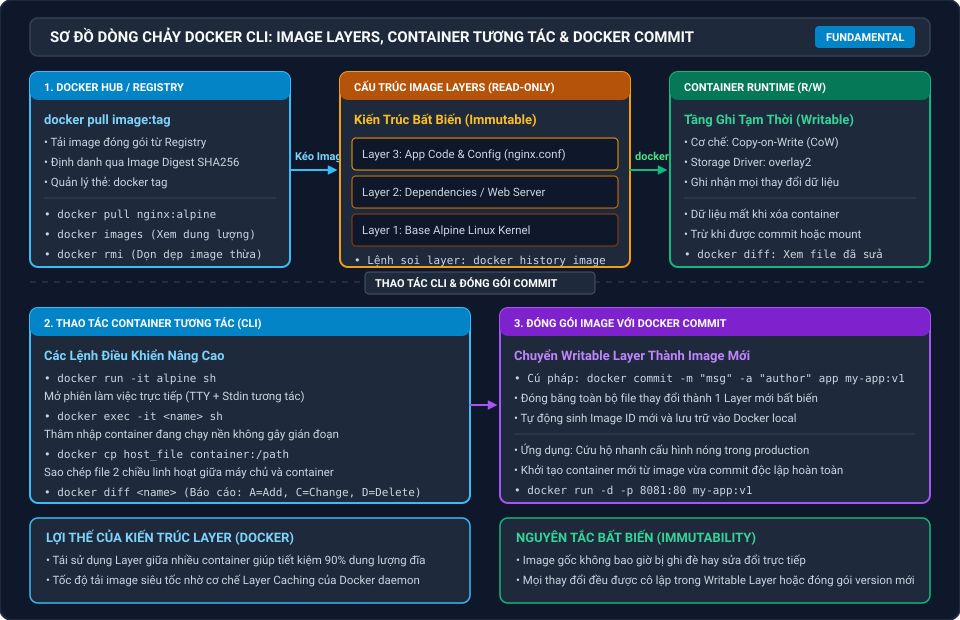

# Lab 9: Nhập Môn Docker CLI, Quản Trị Image Layers & Thao Tác Container

Chào mừng bạn đến với bài thực hành nhập môn chuyên sâu về **Docker CLI, Kiến Trúc Image Layers và Thao Tác Container Tương Tác**!

Trong quy trình phát triển và vận hành phần mềm hiện đại, việc sử dụng thành thạo các câu lệnh Docker cơ bản và hiểu rõ cách Docker tổ chức hệ thống file dạng tầng (**Layered Filesystem**) là nền tảng tối quan trọng trước khi bạn bước sang viết Dockerfile hay cấu hình runtime phức tạp.

Bài thực hành này giúp bạn làm chủ toàn diện các thao tác thực chiến trên dòng lệnh với Docker Images và Containers.

---

## Kiến Trúc Image Layers & Dòng Thao Tác CLI

### Bảng Mô Tả Các Thành Phần Cốt Lõi

| Thành Phần | Bản Chất Kỹ Thuật | Vai Trò & Ứng Dụng Trong Thực Tế |
|---|---|---|
| **Docker Registry / Hub** | Kho lưu trữ Image tập trung | Tải image chính thức (`docker pull`), quản lý phiên bản qua thẻ Tag và mã băm định danh SHA256 (Image Digest). |
| **Image Layers (Read-Only)** | Các tầng hệ thống file bất biến | Mỗi câu lệnh cấu hình tạo nên 1 layer chỉ đọc; các container cùng image sẽ chia sẻ chung các layer này giúp tiết kiệm tối đa ổ đĩa. |
| **Writable Container Layer** | Tầng ghi tạm thời (Copy-on-Write) | Mọi file tạo mới, sửa đổi hoặc xóa khi container hoạt động đều được lưu trên tầng này qua storage driver `overlay2`. |
| **Thao Tác Tương Tác CLI** | `run -it`, `exec -it`, `cp`, `diff` | Kiểm tra, debug tiến trình trực tiếp, sao chép file hai chiều giữa host và container, đối soát các file bị sửa đổi. |
| **Đóng Gói Bằng Docker Commit** | `docker commit` | Chuyển đổi toàn bộ thay đổi ở tầng Writable Layer thành một Image độc lập mới để tái sử dụng. |

---

## Lộ Trình 3 Bước Thực Hành

| Bước | Chủ Đề Trọng Tâm | Kỹ Năng Đạt Được |
|---|---|---|
| **Bước 1** | **Quản Trị Docker Images & Phân Tích Layers** | Kéo image từ Docker Hub, soi chi tiết các layer với `docker history`, phân tích kích thước image và quản lý thẻ version (`docker tag`, `docker rmi`). |
| **Bước 2** | **Thao Tác Container Tương Tác & Sao Chép CLI** | Mở shell tương tác (`run -it`), thâm nhập container đang chạy (`exec -it`), sao chép file 2 chiều (`docker cp`) và theo dõi thay đổi với `docker diff`. |
| **Bước 3** | **Cơ Chế Copy-on-Write & Đóng Gói Docker Commit** | Hiểu bản chất cơ chế CoW, đóng băng trạng thái container thành image mới bằng `docker commit`, gắn metadata và khởi chạy kiểm thử độc lập. |

---

## Yêu Cầu Môi Trường Thực Hành

- Môi trường Ubuntu Linux trên Killercoda đã được cấu hình sẵn Docker Engine.
- Thư mục mẫu chứa mã nguồn HTML tùy biến đã được chuẩn bị tại `/root/sample-site`.
- Mỗi bước đều có phần **Thử Thách (DIY Challenge)**. Sau khi hoàn thành thao tác, hãy bấm nút **Check** để hệ thống tự động kiểm tra và đánh giá kết quả của bạn.

Bấm **START** hoặc chọn **Bước 1** để bắt đầu bài thực hành!
