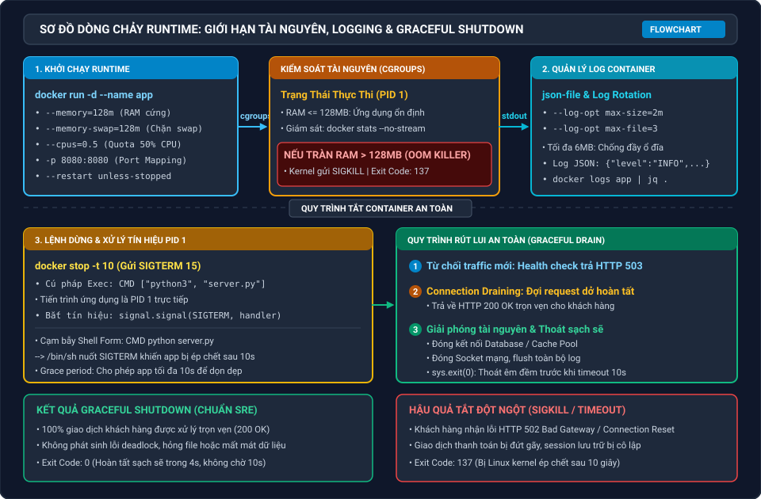

# Lab 9: Cấu Hình Tài Nguyên Runtime, Quản Lý Log Container & Kiểm Thử Graceful Shutdown

Chào mừng bạn đến với bài thực hành chuyên sâu về **Quản trị Runtime, Giám sát Log và Tắt Ứng Dụng An Toàn trong Docker**!

Trong môi trường triển khai thực tế (Production / Kubernetes), việc đóng gói ứng dụng vào container chỉ là bước khởi đầu. Một kỹ sư DevOps chuyên nghiệp phải nắm vững cách kiểm soát tài nguyên phần cứng để tránh một container ngốn cạn RAM làm sập cả cụm máy chủ, cấu hình xoay vòng log để bảo vệ dung lượng ổ đĩa, và đảm bảo ứng dụng có thể tắt êm đềm (**Graceful Shutdown**) mà không làm gián đoạn các giao dịch đang thanh toán dở dang của khách hàng.

Bài thực hành này được thiết kế tương thích trực tiếp với bài học **"Tổng quan về Container và Docker"** trên hệ thống đào tạo.

---

## Kiến Trúc Runtime & Chuỗi Kiểm Soát Vận Hành

### Bảng Mô Tả Các Khối Chức Năng Cốt Lõi

| Tầng Quản Trị | Cơ Chế Kỹ Thuật | Vai Trò & Ứng Dụng Trong Thực Tế |
|---|---|---|
| **Vòng Đời & Tham Số Runtime** | Lifecycle (`create`, `run`, `stop`, `rm`), `-e`, `--env-file`, `-p`, `--restart` | Quản lý trạng thái container, bảo mật biến môi trường và tự động phục hồi khi tiến trình gặp sự cố đột ngột. |
| **Giới Hạn Tài Nguyên (cgroups)** | `--cpus`, `--memory`, `--memory-swap` | Thiết lập hạn ngạch CPU và RAM tối đa; hiểu rõ cơ chế kích hoạt **Linux OOM Killer** (mã thoát 137) khi bộ nhớ bị rò rỉ. |
| **Quản Lý Log Container** | `json-file`, `--log-opt max-size`, `--log-opt max-file` | Ngăn chặn nguy cơ tràn ổ cứng bằng chính sách xoay vòng log tự động (**Log Rotation**), xuất log dạng JSON có cấu trúc. |
| **Tín Hiệu Hệ Điều Hành & Graceful** | UNIX Signals (`SIGTERM`, `SIGKILL`), PID 1 Problem | Phân biệt shell form và exec form trong Dockerfile; thực hiện quy trình **Connection Draining** và tắt sạch sẽ (`exit 0`). |

---

## Lộ Trình 3 Bước Thực Hành

| Bước | Chủ Đề Trọng Tâm | Kỹ Năng Đạt Được |
|---|---|---|
| **Bước 1** | **Vòng Đời Container & Tham Số Runtime** | Làm chủ 4 trạng thái vòng đời, nạp biến môi trường từ file, cấu hình cổng mạng và thiết lập chính sách khởi động lại tự động (`--restart unless-stopped`). |
| **Bước 2** | **Giới Hạn Tài Nguyên & Xoay Vòng Log** | Áp dụng giới hạn cgroups CPU/RAM, thực nghiệm kích hoạt OOM Killer, cấu hình Log Rotation bảo vệ ổ đĩa và truy vấn log nâng cao với `jq`. |
| **Bước 3** | **Tín Hiệu OS Signals & Graceful Shutdown** | Giải quyết triệt để cạm bẫy tiến trình PID 1, bắt tín hiệu `SIGTERM`, thực nghiệm Connection Draining khi có request đang chạy và đảm bảo thoát sạch (`exit 0`). |

---

## Yêu Cầu Môi Trường Thực Hành

- Môi trường Ubuntu Linux trên Killercoda đã được tích hợp sẵn Docker Engine.
- Toàn bộ file mã nguồn mẫu cho ứng dụng Web và script kiểm thử đã được chuẩn bị tại thư mục `/root/app`.
- Mỗi bước đều có phần **Thử Thách (DIY Challenge)**. Sau khi hoàn thành thao tác, hãy bấm nút **Check** để hệ thống tự động kiểm tra và đánh giá kết quả của bạn.

Bấm **START** hoặc chọn **Bước 1** để bắt đầu bài thực hành!
